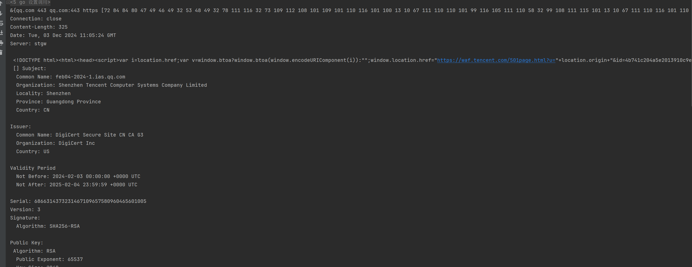

# Fingerscan - Golang 端口指纹识别依赖库

### 此说明由大模型生成

## 简介

`fingerscan` 是一个用Go语言开发的端口信息扫描库，能够识别端口所搭载的服务和应用版本信息，以及web指纹。
* 注 此项目为依赖库，不具有完整端口扫描功能，仅作为指纹识别使用
## 功能特点

- **协议识别**：`fingerscan` 能够识别端口上运行的服务类型，如SSH、Mysql等。
- **应用版本检测**：对于常见的应用服务，`fingerscan` 能够检测并显示其版本信息。
- **用户友好的界面**：提供简洁明了的命令行界面，易于操作。
- **跨平台支持**：作为Go语言编写的应用，`fingerscan` 支持跨平台运行，包括Windows、Linux和macOS。

## 运行

要安装 `fingerscan`，请确保你的系统已经安装了Go语言环境，以lib包的方式引入到自己的项目中。

速度越慢越精准，如果请根据场景调节适当的时间

> fingerscan.ScanFingerprint(os.Args[1], port, 20*time.Second)
> 

运行方式：fingerscan exp.com 443

## 贡献
我们欢迎任何形式的贡献，包括代码提交、bug报告和功能请求。如果你有兴趣参与 fingerscan 的开发，请访问我们的GitHub仓库
